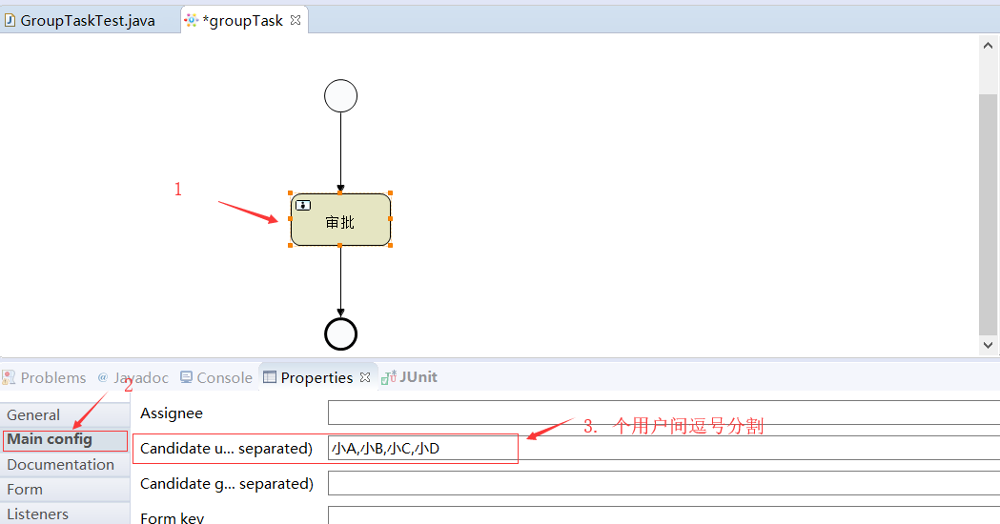

[TOC]

## 一、工作流介绍

### 1.1 什么是工作流

- **工作流（`workflow`）**：是对工作流程及其个操作步骤之间业务规则的抽象、概括描述
- **工作流建模**：即将工作流程中的工作如何前后组织在一起的逻辑和规则，在计算机中以恰当的模型表达并对其实施计算
- **要解决的问题**：是为实现某个业务目标，利用计算机在多个参与者之间按某种预定规则自动传递文档、信息或者任务

### 1.2 工作流对团队的作用

1. 提高效率，减少等待
2. 规范行为，落实制度
3. 协同内外，快速响应
4. 监控全面，提升执行

### 1.3 工作流引擎技术选型

| `JBPM`        | `Activiti` |
| ------------- | ---------- |
| `Hibernate`   | `Mybatis`  |
| `Drools Flow` | `JBPM4`    |
| `JPA`         | `Spring`   |
| `Message`     | `RESTFUL`  |
| ......        | ......     |

为什么选择`Activiti6.0`？

1. 老牌、程数、稳定、满足`BPMN2.0`规范

2. 用户众多、社区活跃、趋势良好

3. 易于上手基于`spring`、`mybatis`常用互联网技术堆栈

### 1.4 `BPMN2.0`规范

​	`Business Process Model and Notation` 是一套业务流程模型与符号建模标准；

精准的执行来描述元素的操作；以XML为载体，以符号可视化业务。

`BPMN2.0`元素：

- 流对象`FlowObjects`
- 连接对象`ConnectingObject`
- 数据Data
- 泳道`Swimlanes`
- 描述对象Artifacts

## 二、`activiti`入门案例

### 2.1 开发环境介绍

- `JDK1.8`
- `Idea2019.1.2`（`actiBPM`插件）
- `MySQL8.0`
- `Activiti6.0`

## 三、流程引擎配置及服务组件

### 3.1 流程引擎配置

#### 3.1.1 流程引擎配置对象

​	`ProcessEngineConfiguration`对象代表一个`Activiti`流程引擎的全部配置，该类提供一系列创建 `ProcessEngineConfiguration` 实例的静态方法，这些方法用于读取和解析相应的配置文件，并返回 `ProcessEngineConfiguration` 的实例。

- 配置文件读取

  ~~~java
  // 1. 读取默认配置文件（读取类路径下的activiti.cfg.xml文件）
  createProcessEngineConfigurationFromResourceDefault()
      
  // 2. 读取指定位置配置文件（可以指定bean的名称，bean必须存在）
  createProcessEngineConfigurationFromResource(String resource)
  createProcessEngineConfigurationFromResource(String resource, String beanName)
      
  // 3. 通过输入流读取配置文件（可以指定bean的名称，bean必须存在）
  createProcessEngineConfigurationFromInputStream(InputStream inputStream)
  createProcessEngineConfigurationFromInputStream(InputStream inputStream, String beanName)
  ~~~

#### 3.1.2 数据源配置

​	`Activiti` 在启动时，会读取数据源配置，用于对数据库进行相应的操作。 

- 支持的数据库：`H2`、`MySQL`、`Oracle`、`PostgreSQL`、`DB2`、`MSSQL`

##### 3.1.2.1 `jdbc`配置

~~~xml
<bean id="processEngineConfiguration" class="org.activiti.engine.impl.cfg.StandaloneProcessEngineConfiguration">
    <property name="jdbcDriver" value="com.mysql.cj.jdbc.Driver"/>
    <property name="jdbcUrl" value="jdbc:mysql://localhost:3306/act"/>
    <property name="jdbcUsername" value="root"/>
    <property name="jdbcPassword" value="1995"/>
</bean>
~~~

##### 3.1.2.2 `dpcp`配置

~~~xml
<!-- 使用DBCP 数据源 -->
<bean id="dataSource" class="org.apache.commons.dbcp.BasicDataSource">
    <property name="driverClassName" value="com.mysql.jdbc.Driver" />
    <property name="url" value="jdbc:mysql://localhost:3306/act" />
    <property name="username" value="root" />
    <property name="password" value="123456" />
</bean>
<bean id="processEngineConfiguration"
class="org.activiti.engine.impl.cfg.StandaloneProcessEngineConfiguration">
	<property name="dataSource" ref="dataSource" />
</bean>
~~~

##### 3.1.2.3 `c3p0`配置

~~~xml
<!-- 使用 C3P0 数据源 -->
<bean id="dataSource" class="com.mchange.v2.c3p0.ComboPooledDataSource">
    <property name="driverClass" value="com.mysql.jdbc.Driver" />
    <property name="jdbcUrl" value="jdbc:mysql://localhost:3306/act" />
    <property name="user" value="root" />
    <property name="password" value="123456" />
</bean>
<bean id="processEngineConfiguration"
class="org.activiti.engine.impl.cfg.StandaloneProcessEngineConfiguration">
	<property name="dataSource" ref="dataSource" />
</bean
~~~

##### 3.1.2.4 其他数据源配置

​	如果不使用第三方数据源， 直接使用 `Activiti` 提供的数据源， 那么还可以指定其他一些数 据 库 属 性 。 `Activiti` 默 认 使 用 的 是 `myBatis` 的 数 据 连 接 池 ， 因 此`ProcessEngineConfiguration` 中也提供了一些 `MyBatis` 的配置：

- `jdbcMaxActiveConnections`：连接池最大活跃连接数 默认10
- `jdbcMaxIdleConnections`：连接池最大的空闲连接数。
- `jdbcMaxCheckoutTime`：连接池创建连接的等待时间 默认值为：20000毫秒
- `jdbcMaxWaitTime`：最大等待时长 默认值为：20000毫秒

##### 3.1.2.5  数据库策略配置

​	`ProcessEngineConfiguration` 提供了 `databaseSchemaUpdate` 属性，该项可以设置流
程引擎启动和关闭时数据库执行的策略。 `Activiti` 的官方文档中，`databaseSchemaUpdate`
有以下三个值：

**false**：（默认值） `Activiti`启动时，会对比数据库表中保存的版本，如果没有表或者版本不匹配时，将在启动时抛出异常。
true： `Activiti`启动时会对数据库中所有的表进行更新，如果表不存在，则自动创建。（常用）
create-drop： `Activiti`启动时，会执行数据库表的创建操作。在 `Activiti` 关闭时，执行数据库表的删除操作。

## 四、流程引擎核心内容讲解

### 4.1 流程定义

#### 4.1 .1 部署流程定义

##### 4.1.1.1 从类路径发布流程定义文件

~~~java
@Test
public void deployProcessDefinition_classpath() {
    // 部署类路径下流程定义文件
    Deployment deployment = ProcessEngines.getDefaultProcessEngine()
        .getRepositoryService() // 获取流程定义service
     	.createDeployment() // 创建部署对象
		.addClasspathResource("helloword.bpmn") // 添加流程文件
		.addClasspathResource("helloword.png") // 添加流程图片
		.name("流程定义") // 部署名称
		.category("测试流程定义") // 部署分类
		.deploy();
		
    System.out.println("流程部署id： " + deployment.getId());
    System.out.println("流程部署名称：" + deployment.getName());
    System.out.println("流程部署时间：" + deployment.getDeploymentTime());
    System.out.println("流程分类：" + deployment.getCategory());

    /**
		流程部署id： 12501
		流程部署名称：流程定义
		流程部署时间：Sat Jun 29 16:00:05 CST 2019
		流程分类：测试流程定义
	*/
}
~~~

###### 4.1.1.1 .1部署对象和流程定义相关表

- 部署对象表`act_re_deployment` :存放流程部署信息

  `SELECT * FROM act_re_deployment` 

  

- 流程定义表`act_re_procdef`：存放`bpmn`文件信息,`KEY_`值相同会进行版本升级
  `SELECT * FROM act_re_procdef` 

  

  

- 资源文件表`act_ge_bytearray`  存放`bpmn`文件和图片

  `SELECT * FROM act_ge_bytearray` 

  

- 主键生成策略表`act_ge_property`  指定下一个流程部署`ID_`

  `SELECT * FROM act_ge_property`

  

##### 4.1.1.2 部署zip格式流程定义文件

- 将`bpmn`和`png`文件打包成`zip`格式文件

  ~~~java
  @Test
  public void deployProcessDefinition_zip() {
      InputStream in = this.getClass()
          .getClassLoader()
          .getResourceAsStream("helloword.zip");
      ZipInputStream zipInputStream = new ZipInputStream(in);
      // 部署类路径下流程定义文件
      Deployment deployment = ProcessEngines.getDefaultProcessEngine()
          .getRepositoryService() // 获取流程定义service
          .createDeployment() // 创建部署对象
          .addZipInputStream(zipInputStream ) // 添加流程zip压缩包
          .name("zip流程定义") // 部署名称
          .category("测试zip流程定义") // 部署分类
          .deploy();
  
      System.out.println("流程部署id： " + deployment.getId());
      System.out.println("流程部署名称：" + deployment.getName());
      System.out.println("流程部署时间：" + deployment.getDeploymentTime());
      System.out.println("流程分类：" + deployment.getCategory());
  
      /**
  		流程部署id： 15001
  		流程部署名称：zip流程定义
  		流程部署时间：Sat Jun 29 16:47:55 CST 2019
  		流程分类：测试zip流程定义
  	*/
  }
  ~~~

#### 4.1.2 查询流程定义

~~~java
@Test
public void findProcessDefinition() {
    List<ProcessDefinition> list = ProcessEngines.getDefaultProcessEngine()
        .getRepositoryService() // 获取流程定义相关service
        .createProcessDefinitionQuery() // 创建流程定义查询
        /**指定查询条件*/
        // 使用部署对象ID查询
        //.deploymentId(deploymentId) 
        //使用流程定义id查询
        //.processDefinitionId(processDefinitionId) 
        // 使用流程定义的key查询
        //.processDefinitionKey(processDefinitionKey) 
        // 使用流程定义名称模糊查询
        //.processDefinitionNameLike(processDefinitionNameLike) 
        /**排序*/
        .orderByProcessDefinitionVersion().asc() // 版本升序排序
        //.orderByProcessDefinitionName().desc() // 流程定义名称降序排序

        /**返回结果集*/
        .list(); // 返回一个集合列表,封装流程定义
    //	.singleResult(); // 返回唯一结果集
    //	.count(); // 返回结果集数量
    //	.listPage(firstResult, maxResults); //分页查询

    list.forEach(pd -> {
        // 流程定义key + 版本 + 部署id减去最后位 + 版本
        System.out.println("流程定义id：" + pd.getId()); 
        // 对应helloword.bpmn文件中的name
        System.out.println("流程定义名称：" + pd.getName()); 
        // 对应helloword.bpmn文件中的id
        System.out.println("流程定义key：" + pd.getKey()); 
        // 流程定义版本, key相同版本加1, 默认版本为1
        System.out.println("流程定义版本：" + pd.getVersion());	
        // bpmn的文件名称
        System.out.println("bpmn资源文件名称：" + pd.getResourceName()); 
        // 图片名称
        System.out.println("png资源文件名称：" + pd.getDiagramResourceName());
        System.out.println("部署对象id：" + pd.getDeploymentId());
        System.out.println("##########################################");
    });
    /**
		流程定义id：helloword:4:15004
		流程定义名称：hellowordProcess
		流程定义key：helloword
		流程定义版本：4
		bpmn资源文件名称：helloword.bpmn
		png资源文件名称：helloword.png
		部署对象id：15001
		##########################################
		*/
}
~~~

#### 4.1.3 删除流程定义

~~~java
@Test
public void deleteProcessDefinition() {
    String deploymentId = "15001";
    /**
		 * 不带级联的删除
		 * 只能删除没有启动的流程,如果流程启动，就会抛出异常
		 */
    //		ProcessEngines.getDefaultProcessEngine()
    //			.getRepositoryService()
    //			.deleteDeployment(deploymentId ); // 使用部署id删除流程定义
    //		System.out.println("删除成功");

    /**
		 *  级联删除流程定义
		 * 可以删除以启动的流程 "慎用"
		 */
    ProcessEngines.getDefaultProcessEngine()
        .getRepositoryService()
        .deleteDeployment(deploymentId, true); // 使用部署id删除流程定义.级联删除
}
~~~

4.4 查看流程图

~~~java
@Test
public void viewPic() {
    String deploymentId = "12501";
    String resourceName = "";
    // 获取流程定义资源文件
    List<String> resourceNames = ProcessEngines.getDefaultProcessEngine()
        .getRepositoryService()
        .getDeploymentResourceNames(deploymentId);

    // 获取图片资源名称
    for (String name : resourceNames) {
        if (name.endsWith(".png")) {
            resourceName = name;
        }
    };
    // 获取图片输入流
    InputStream inputStream = ProcessEngines.getDefaultProcessEngine()
        .getRepositoryService()
        // 通过部署id和资源名称 查询当前流程图
        .getResourceAsStream(deploymentId, resourceName); 

    // 将图片生成到D 盘下
    File file = new File("D:/"+resourceName);
    try {
        FileUtils.copyInputStreamToFile(inputStream, file);
    } catch (IOException e) {
        // TODO Auto-generated catch block
        e.printStackTrace();
    }
}
~~~

#### 4.1.4 查询最新版本流程定义

~~~java
/**
 *  附加功能：查询最新版本流程定义
 */
@Test
public void findLastVersionProcessDefinition() {
    String processDefinitionKey = "helloword";
    ProcessDefinition processDefinition = ProcessEngines
        .getDefaultProcessEngine()
        .getRepositoryService()
        .createProcessDefinitionQuery()
        .processDefinitionKey(processDefinitionKey )
        .latestVersion()
        .singleResult();
    System.out.println("流程定义版本: " + processDefinition.getVersion());
}
~~~

#### 4.1.5 删除所有key相同的流程定义

~~~java
@Test
public void deleteProcessDefinitionByKey() {
    ProcessEngine processEngine = ProcessEngines.getDefaultProcessEngine();
    RepositoryService repositoryService = processEngine.getRepositoryService();
    // 1. 使用流程定义key 查询所有流程部署
    String processDefinitionKey = "helloword";
    List<ProcessDefinition> list = repositoryService
        .createProcessDefinitionQuery()
        .processDefinitionKey(processDefinitionKey)
        .list();
    // 2. 删除所有流程定义
    for (ProcessDefinition pd : list) {
        String deploymentId = pd.getDeploymentId();
        repositoryService.deleteDeployment(deploymentId,true);
    }
}
~~~

### 4.2 流程实例

#### 4.2.1 启动流程实例

- 启动流程实例前必须先部署流程定义文件

  ~~~java
  /**
   * 2. 启动流程实例
   */
  @Test
  public void startProcessInstance() {
      // 1. 获取流程引擎对象
      ProcessEngine processEngine = ProcessEngines.getDefaultProcessEngine();
  
      // 2. 获取runtimeService(正在执行的流程实例和执行对象相关的service)
      RuntimeService runtimeService = processEngine.getRuntimeService();
  
      /**
  		 * 3.根据流程定义key启动流程 
  		 * key对应流程定义bpmn文件中的id属性 即act_re_procdef表中的字段 :"KEY"
  		 * 使用key启动默认启动最新版本的流程定义
  		 */
      String key = "helloword";
      // 流程实例对象
      ProcessInstance processInstance = runtimeService.startProcessInstanceByKey(key);
      // 表act_ru_execution
      System.out.println("流程实例id:" + processInstance.getId()); // 流程实例id:2501
      System.out.println("流程定义id:" + processInstance.getProcessDefinitionId()); // 流程定义id:helloword:1:4
      System.out.println("流程定义名称:" + processInstance.getProcessDefinitionName()); // 流程定义名称:null
  }
  ~~~

##### 4.2.1.1 流程实例相关表

- 执行对象表`act_ru_execution` 正在执行的对象

  `SELECT * FROM act_ru_execution` 存放正在执行的流程实例数据

  

  **注意：**

  1. 如果是单例流程(没有分支)，那么流程实例ID和执行对象ID是相同的

  2. 一个流程实例只有一个，执行对下个可以有多个（存在分支和聚合）

- 流程实例历史表`act_hi_procinst` 存放流程实例的历史数据

  `SELECT * FROM act_hi_procinst`

  

- 正在执行的任务表`act_ru_task` 存放正在执行的任务数据（只有节点是`UserTask`时此表才有数据）

  `SELECT * FROM act_ru_task`

  

- 任务历史表`act_hi_taskinst` 存放任务历史数据 （只有节点是`UserTask`时此表才有数据）

  `SELECT * FROM act_hi_taskinst`

  

- 活动节点历史表`act_hi_actinst` 所有活动节点历史数据

  `SELECT * FROM act_hi_actinst`

  

#### 4.2.2 查询个人任务列表

~~~java
@Test
public void findPersonalTaskList() {
    String assignee = "王五";
    List<Task> list = ProcessEngines.getDefaultProcessEngine()
        .getTaskService()
        .createTaskQuery()
        /**WHERE 条件*/
        .taskAssignee(assignee) // 指定办理人
        //.deploymentId(deploymentId) // 根据部署id查询
        //.processDefinitionKey(processDefinitionKey) // 根据流程定义key查询
        //.processInstanceId(processInstanceId) // 根据流程实例id查询
        /**ORDER BY 排序*/
        //.orderByTaskAssignee() // 根据办理人排序
        .orderByTaskCreateTime() // 根据任务创建时间排序
        /**结果集*/
        //.singleResult() //单个结果
        //.count()	//结果个数
        .list();
    // ===================== 遍历结果集===================

    list.forEach(t -> {
        System.out.println("任务id：" + t.getId());
        System.out.println("任务名称：" + t.getName());
        System.out.println("任务办理人：" + t.getAssignee());
        System.out.println("任务创建时间：" + t.getCreateTime());
        System.out.println("流程实例id：" + t.getProcessInstanceId());
        System.out.println("流程定义id：" + t.getProcessDefinitionId());
        System.out.println("执行对象id：" + t.getExecutionId());
        System.out.println("############################################");
    });
}
~~~

#### 4.2.3 完成个人任务

~~~java
@Test
public void completeMyPersonalTask() {
    String taskId = "22504";
    ProcessEngines.getDefaultProcessEngine()
        .getTaskService()
        .complete(taskId);
}
~~~

#### 4.2.4 判断流程是否结束

~~~java
@Test
public void isProcessEnd() {
    String processInstanceId = "22501";
    ProcessInstance processInstance = ProcessEngines.getDefaultProcessEngine()
        .getRuntimeService()
        .createProcessInstanceQuery() // 创建一个流程实例查询对象
        .processInstanceId(processInstanceId) // 使用流程实例id查询
        .singleResult();

    if (processInstance == null) {
        System.out.println("流程已结束");
    } else {
        System.out.println("流程还未结束");
    }
}
~~~

#### 4.2.5  查询历史任务

~~~java
@Test
public void findHistoryTask() {
    String assignee = "张三";
    List<HistoricTaskInstance> list = ProcessEngines.getDefaultProcessEngine()
        .getHistoryService() // 历史数据相关service
        .createHistoricTaskInstanceQuery() // 创建历史任务实例查询
        .taskAssignee(assignee) // 指定历史任务办理人
        .list();

    for (HistoricTaskInstance ht : list) {
        System.out.println("任务id：" + ht.getId());
        System.out.println("任务名称：" + ht.getName());
        System.out.println("任务办理人：" + ht.getAssignee());
        System.out.println("流程实例id：" + ht.getProcessInstanceId());
        System.out.println("任务开始时间：" + ht.getStartTime());
        System.out.println("任务结束时间：" + ht.getEndTime());
        System.out.println("任务持续时间：" + ht.getDurationInMillis());
        System.out.println("############################");
    }
}
~~~

4.2.6 查询历史流程实例

~~~java
@Test
public void findHistoryProcessInstance() {
    String processInstanceId = "22501";
    HistoricProcessInstance hiProcessInstance = ProcessEngines.getDefaultProcessEngine()
        .getHistoryService() // 历史数据相关service
        .createHistoricProcessInstanceQuery()
        .processInstanceId(processInstanceId)
        .singleResult();

    System.out.println("流程实例id：" + hiProcessInstance.getId());
    System.out.println("流程实例名称：" + hiProcessInstance.getName());
    System.out.println("流程实例定义id：" + hiProcessInstance.getProcessDefinitionId());
    System.out.println("流程实例定义key：" + hiProcessInstance.getProcessDefinitionKey());
    System.out.println("流程实例开始时间：" + hiProcessInstance.getStartTime());
    System.out.println("流程实例结束时间：" + hiProcessInstance.getEndTime());
}
~~~

### 4.3 流程变量

​	流程变量在整个工作中扮演很重要的作用。例如：请假流程中有请假天数、请假原因等一些参数都为流程变量。流程变量的作用域范围是只对应一个流程实例，也就是说各个流程实例的流程变量是不互相影响的。流程实例结束后流程变量还保存在数据库中。

- 流程变量的作用
  1. 用来传递业务参数 如：请见原因 、请假天数
  2. 指定连线完成任务 如：同意 、拒绝
  3. 动态指定任务的办理人

#### 4.3.1 设置流程变量的场景

1. `runtimeService`设置流程变量

   ~~~java
   // 表示使用执行对象id和流程变量名称 设置流程变量的值 一次只能设置一个值
   runtimeService.setVariable(executionId, variableName, value); 
   // 表示使用执行对象id和Map集合 设置流程变量的值 （map中key为流程变量名称，value为流程变量的值）一次可以设置多个值
   runtimeService.setVariables(executionId, variables);
   ~~~

2.  `taskService`设置流程变量

   ~~~java
   // 表示使用任务id和流程变量名称 设置流程变量的值 一次只能设置一个值
    taskService.setVariable(taskId, variableName, value);
   // 表示使用任务id和Map集合 设置流程变量的值 （map中key为流程变量名称，value为流程变量的值）一次可以设置
    taskService.setVariables(taskId, variables);
   ~~~

3.  启动流程实例时 设置流程变量

   ~~~java
   Map<String,Object> variables = new HashMap<>();
   runtimeService.startProcessInstanceByKey(processDefinitionKey, variables)
   ~~~

4. 完成任务时 设置流程变量

   ~~~java
   Map<String,Object> variables = new HashMap<>();
   taskService.complete(taskId, variables);
   ~~~

#### 4.3.2 流程变量相关表

- 正在执行的流程变量表`act_ru_variable`

  `SELECT * FROM act_ru_variable`

  

- 历史流程变量表`act_hi_varinst`

  `SELECT * FROM act_hi_varinst`

  

#### 4.3.3 获取流程变量

~~~java
// runtimeService和TaskService获取流程变量的方式相同
// 1. 使用执行id 和 流程变量名获取流程变量值
 Object variable =  runtimeService.getVariable(executionId, variableName);
// 2. 使用执行id 获取所有流程变量
 Map<String, Object> variables = runtimeService.getVariables(executionId);
// 3. 使用执行id 和 多个流程变量名 获取流程变量值
 List<String> variableNames = new ArrayList<>();
 Map<String, VariableInstance> variableInstances = runtimeService.getVariableInstances(executionId, variableNames);
~~~

#### 4.3.4 设置和获取流程变量注意事项

1. 设置`javabean`类型流程变量时需要实现序列化接口

2. 获取`javabean`类型流程变量时，若`javabean`未指定序列化版本会报错

   需要设置序列化版本号`private static final long serialVersionUID = 1L;`

3. `setVariableLocal` 和 `setVariable`的区别

   `setVariableLocal` 会将流程变量与`taskId`进行绑定，即使变量名称相同，不同的`taskId`之间该流程变量也不会被覆盖

   `setVariableLocal` 设置的流程变量在其他任务中无法获取到与当前`taskId`绑定的流程变量

   `setVariable`在不同的task中若变量名称相同，后面任务设置的变量会覆盖前面任务设置的变量值

### 4.4 流程历史数据查询

#### 4.4.1 历史流程实例查询

- 与表`act_hi_procinst`相关

~~~java
@Test
public void findHistoryProcessInstance() {
    HistoricProcessInstance historicProcessInstance = ProcessEngines.getDefaultProcessEngine()
        .getHistoryService()
        .createHistoricProcessInstanceQuery()
        .processInstanceId("22501")
        .singleResult();

    System.out.println("历史流程实例id：" + historicProcessInstance.getId());
    System.out.println("流程定义id：" + historicProcessInstance.getProcessDefinitionId());
    System.out.println("流程定义名称：" + historicProcessInstance.getProcessDefinitionName());
    System.out.println("流程定义key：" + historicProcessInstance.getProcessDefinitionKey());
}
~~~

#### 4.4.2 历史活动查询

- 与表`act_hi_actinst`相关

~~~java
@Test
public void findHistoryActiviti() {
    String processInstanceId = "37501";

    List<HistoricActivityInstance> list = ProcessEngines.getDefaultProcessEngine()
        .getHistoryService()
        .createHistoricActivityInstanceQuery()
        .processInstanceId(processInstanceId)
        .orderByHistoricActivityInstanceStartTime().asc()
        .list();

    for (HistoricActivityInstance hai : list) {
        System.out.println(hai.getId());
        System.out.println(hai.getActivityName());
        System.out.println(hai.getProcessDefinitionId());
        System.out.println(hai.getProcessInstanceId());
        System.out.println(hai.getTaskId());
        System.out.println(hai.getAssignee());
    }
}
~~~

#### 4.4.3 历史任务查询

- 与表`act_hi_taskinst`相关

~~~java
@Test
public void findHistoryTask() {
    String processInstanceId = "37501";

    List<HistoricTaskInstance> list = ProcessEngines.getDefaultProcessEngine()
        .getHistoryService() // 历史数据相关service
        .createHistoricTaskInstanceQuery() // 创建历史任务实例查询
        .processInstanceId(processInstanceId)
        .list();

    for (HistoricTaskInstance ht : list) {
        System.out.println("任务id：" + ht.getId());
        System.out.println("任务名称：" + ht.getName());
        System.out.println("任务办理人：" + ht.getAssignee());
        System.out.println("流程实例id：" + ht.getProcessInstanceId());
        System.out.println("任务开始时间：" + ht.getStartTime());
        System.out.println("任务结束时间：" + ht.getEndTime());
        System.out.println("任务持续时间：" + ht.getDurationInMillis());
        System.out.println("############################");
    }
}
~~~

#### 4.4.4 历史流程变量查询

- 与表`act_hi_varinst`相关

~~~java
@Test
public void findHistoryProcessVariables() {
    String processInstanceId = "37501";

    List<HistoricVariableInstance> list = ProcessEngines.getDefaultProcessEngine()
        .getHistoryService()
        .createHistoricVariableInstanceQuery()
        .processInstanceId(processInstanceId)
        .list();

    for (HistoricVariableInstance hvi : list) {
        System.out.println("实例流程变量名：" + hvi.getVariableName());
        System.out.println("实例流程变量值：" + hvi.getValue());
    }
}
~~~

### 4.5 小结


## 五、 流程图组件介绍

### 5.1 连线


- 设置流程变量执行指定流程完成任务

~~~java
@Test
public void setProcessVariableAndCompleteTask() {
    String taskId = "72503";
    String message = "重要";
    Map<String, Object> variables = new HashMap<>();
    variables.put("message", message);
    // 设置流程变量，并完成任务。下一个连线，对应sequenceFlow.bpmn中的${message=='不重要'}
    ProcessEngines.getDefaultProcessEngine()
        .getTaskService()
        .complete(taskId, variables);
    System.out.println("完成任务，任务ID：" + taskId);
}
~~~

### 5.2 网关

#### 5.2.1 排他网关

- 排它网关相当于`java`中的`if else`结构，可以设置默认执行流程

  

- 设置流程变量并完成任务

~~~java
@Test
public void setProcessVariableAndCompleteTask() {
    String taskId = "90004";
    Long money = 800L;
    Map<String, Object> variables = new HashMap<>();
    variables.put("money", money);
    // 设置流程变量，并完成任务。下一个连线，对应sequenceFlow.bpmn中的${message=='不重要'}
    ProcessEngines.getDefaultProcessEngine()
        .getTaskService()
        .complete(taskId, variables);
    System.out.println("完成任务，任务ID：" + taskId);
}
~~~


#### 5.2.2 并行网关

- 并行网关流程图


- 启动上述并流程后

  - `act_ru_execution`表存在一个流程实例和两个执行对象

    

  - `act_hi_procinst`表历史流程实例只有一个

    

  - `act_ru_task`表正在执行的任务有两个：发货、付款

    
  
  - `act_hi_taskinst`表历史任务两个
  
    
  
  - `act_hi_actinst`表并行网关历史活动四个
  
    

- 上述流程结束后
  - `act_ru_execution`表 无正在执行的流程实例和执行对象
  - `act_hi_procinst`表 有一个历史流程实例
  - `act_ru_task`表 无正在执行的任务
  - `act_hi_taskinst`表 有历史任务四个
  - `act_hi_actinst`表 有九个历史活动
    - 分支（fork）: 为每个顺序流创建一个并发分支
    - 聚合（join）： 这里聚合会产生两个历史活动

- 注意：并行网关不会解析条件，即使顺序流中定义了条件，也会被忽略

### 5.3 开始活动节点

- 结束节点没有出口
- 其他节点有一个或多个出口
  - 如果是一个出口，则表示是一个单线程流
  - 如果有多个出口，则表示开启并发流程

### 5.4 接收活动（`receiveTask`）

​	接收任务是一个简单任务，它会等待对应消息的到达。当前官方只实现了这个任务的`java`语义。当流程达到接收任务，流程状态会保存到数据库中。

​	在任务创建后，意味着**流程会进入等待状态**，知道引擎接收了一个**特定的消息**，这个消息会触发流程穿过接收任务继续执行

~~~java
@Test
public void startProcessInstance() {
    ProcessEngine processEngine = ProcessEngines.getDefaultProcessEngine();
    String processDefinitionKey = "receiveTask";
    ProcessInstance processInstance =processEngine.getRuntimeService()
        .startProcessInstanceByKey(processDefinitionKey);

    System.out.println("流程实例ID:" +processInstance.getId());
    System.out.println("流程定义id:" +processInstance.getProcessDefinitionId());
    /**查询执行对象ID*/
    Execution execution = processEngine.getRuntimeService()
        .createExecutionQuery()	// 创建执行对象查询
        .processInstanceId(processInstance.getId()) // 使用流程实例ID查询
        .activityId("receivetask1") // 对应receiveTask.bpmn文件中当前活动节点id
        .singleResult();
    String executionId = execution.getId();
    /** 使用流程变量 设置当日销售额，用来传递业务参数*/
    processEngine.getRuntimeService()
        .setVariable(executionId, "汇总当日销售额", 21000);

    /**向后执行一步, 如果流程处理等待状态，使得流程继续执行*/
    processEngine.getRuntimeService()
        .signal(executionId);

    /**查询执行对象ID*/
    Execution execution2 = processEngine.getRuntimeService()
        .createExecutionQuery()	// 创建执行对象查询
        .processInstanceId(processInstance.getId()) // 使用流程实例ID查询
        .activityId("receivetask2") // 对应receiveTask.bpmn文件中当前活动节点id
        .singleResult();
    /**从流程变量中获取 当日销售额*/
    Integer value = (Integer) processEngine.getRuntimeService()
        .getVariable(execution2.getId(), "汇总当日销售额");

    System.out.println("给老板发送短信，金额是：" + value);

    /**向后执行一步, 如果流程处理等待状态，使得流程继续执行*/
    processEngine.getRuntimeService()
        .signal(execution2.getId());
}
~~~

### 5.5 用户任务

#### 5.5.1 个人任务

- 分配个人任务方式

  1. 直接指定办理人（实际开发中不够灵活，不推荐使用）

     

  2. 使用流程变量设置任务办理人

     

     - 在在代码中启动流程时通过设置流程变量指定任务办理人

       ~~~java
       ProcessEngine processEngine = ProcessEngines.getDefaultProcessEngine();
       String processDefinitionKey = "personalTask";
       
       // 启动流程时设置流程变量以指定任务办理人 对应personalTask.bpmn文件中的#{userId}
       Map<String,Object> variables = new HashMap<>();
       variables.put("userId", "周芷若");
       ProcessInstance processInstance = processEngine.getRuntimeService()
           .startProcessInstanceByKey(processDefinitionKey, variables);
       ~~~

  3. 使用类动态指定任务办理人

     
  
     - 实现`TaskListener`类通过`notify`方法设置任务办理人
  
       ~~~java
       public class TaskListenerImpl implements TaskListener {
       	
       	/**
       	 * 用来指定任务的办理人
       	 */
       	@Override
       	public void notify(DelegateTask delegateTask) {
       		// delegateTask可以指定个人任务的办理人，也可以指定组任务的办理人
       		/**
       		 *  通过类去查询数据库，将下一个任务的办理人查询获取
       		 *  通过setAssignee/addCandidateUser...方法设置个人/组任务办理人
       		 */
       		delegateTask.setAssignee("灭绝师太");
       	}
       }
       ~~~

- 重新指定任务办理人

  实际工作中，可能当前任务办理人出差或请假无法完成任务办理，则需要**重新指定任务办理人**

  ~~~java
  @Test
  public void setAssigneeTask() {
      // 任务id
      String taskId = "137504";
      // 指定任务办理人
      String userId = "张翠山";
      // 
      ProcessEngines.getDefaultProcessEngine()
          .getTaskService()
          .setAssignee(taskId, userId);
  }
  ~~~

#### 5.5.2 组任务

##### 5.5.2.1 分配组任务方式

1. 直接指定组任务办理人

   

2. 使用流程变量设置任务办理人

   

   - 在在代码中启动流程时通过设置流程变量指定任务办理人

   ~~~java
   @Test
   public void startProcessInstance() {
       ProcessEngine processEngine = ProcessEngines.getDefaultProcessEngine();
       String processDefinitionKey = "groupTask";
   
       // 启动流程时设置流程变量以指定任务办理人 对应groupTask.bpmn文件中的#{userIds}
       Map<String, Object> variables = new HashMap<>();
       variables.put("userIds", "小龙女,杨过");
       ProcessInstance processInstance = processEngine.getRuntimeService()
           .startProcessInstanceByKey(processDefinitionKey, variables );
   
       System.out.println("流程实例ID:" +processInstance.getId());
       System.out.println("流程定义id:" +processInstance.getProcessDefinitionId());
   }
   ~~~

3. 使用类指定任务办理人

   

   - 实现`TaskListener`类通过`notify`方法设置任务办理人

   ~~~java
   @SuppressWarnings("serial")
   public class TaskListenerImpl implements TaskListener {
   	
   	/**
   	 * 用来指定任务的办理人
   	 */
   	@Override
   	public void notify(DelegateTask delegateTask) {
   		// delegateTask可以指定个人任务的办理人，也可以指定组任务的办理人
   		/**
   		 *  通过类去查询数据库，将下一个任务的办理人查询获取
   		 *  然后通过setAssignee/addCandidateGroup...方法设置个人/组任务办理人
   		 */
   		delegateTask.addCandidateUser("张无忌");
   		delegateTask.addCandidateUser("青翼蝠王");
   	}
   }
   ~~~

##### 5.5.2.2 拾取组任务

~~~java
@Test
public void claim() {
    String taskId = "147504";
    String userId = "小A";
    // 将组任务分配个人
    ProcessEngines.getDefaultProcessEngine()
        .getTaskService()
        .claim(taskId, userId); // userId可以时组任务中的成员也可以是其他成员
}
~~~

##### 5.5.2.3 回退到组任务

- 前提 该任务之前必须是组任务

  ```java
  @Test
  public void setAssigee() {
      String taskId = "147504";
      ProcessEngines.getDefaultProcessEngine()
          .getTaskService()
          .setAssignee(taskId, null);
  }
  ```

##### 5.5.2.4 添加组任务成员

~~~java
@Test
public void addGroupUser() {
    String taskId = "147504";
    ProcessEngines.getDefaultProcessEngine()
        .getTaskService()
        .addCandidateUser(taskId, "大H"); // 向组任务中添加成员
}
~~~

##### 5.5.2.5 删除组任务成员

~~~java
@Test
public void deleteGroupUser() {
    String taskId = "147504";
    ProcessEngines.getDefaultProcessEngine()
        .getTaskService()
        .deleteCandidateUser(taskId, "小B"); // 向组任务中删除成员
}
~~~

##### 5.5.2.7 注意

- 组任务拾取后，组任务成员将查询不到个人组任务信息

#### 5.5.3 任务办理人相关表

- `act_ru_identitylink`任务办理人信息表
  `SELECT * FROM act_ru_identitylink`

- `act_hi_identitylink`历史任务办理人信息表

  `SELECT * FROM act_hi_identitylink`

## 六、 附录：`activiti`表介绍

~~~properties
# 1. 部署对象和流程定义相关的表
# 部署对象表 存放流程部署信息
SELECT * FROM act_re_deployment

# 流程定义表act_re_procdef：存放bpmn文件信息
SELECT * FROM act_re_procdef 

# 资源文件表 存放bpmn文件和图片
SELECT * FROM act_ge_bytearray 

# 主键生成策略表
SELECT * FROM act_ge_property
###############################################
# 2. 流程实例相关表
# 正在执行的执行对象表
SELECT * FROM act_ru_execution

# 流程实例历史表
SELECT * FROM act_hi_procinst 

# 正在执行的任务表
SELECT * FROM act_ru_task

# 历史任务表
SELECT * FROM act_hi_taskinst 

# 所有活动节点历史表
SELECT * FROM act_hi_actinst
###############################################
# 3. 流程变量相关表
# 正在执行的流程变量表
SELECT * FROM act_ru_variable

# 历史流程变量表
SELECT * FROM act_hi_varinst
###############################################
# 4. 任务相关表(包括个人任务和组任务)
#任务办理人信息表
SELECT * FROM act_ru_identitylink

# 历史任务办理人信息表
SELECT * FROM act_hi_identitylink
##############################################
# 5. 用户角色相关表
# 用户表
SELECT * FROM act_id_user

# 角色表
SELECT * FROM act_id_group

# 用户角色中间表
SELECT * FROM act_id_membership
~~~

